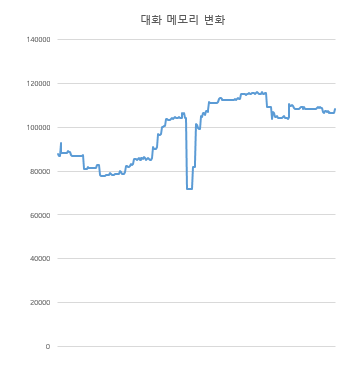

```
---
layout: post
title:  "Android:Out-of-Memory 경험"
author: "LSM"
tag : [android]
categories : [android]
---
```


# Out-of-Memory 경험

- SDK 개발을 하면서 있었던 개인적인 경험을 공유합니다.


안드로이드 SDK 개발을 하면서 앱이 갑작스럽게 종료된 적이 있었다. SDK가 포함된 앱이 메모리를 과도하게 사용하면서 시스템 상에서 어플리케이션을 강제로 종료시킨 것이다. 물론, 서비스 중인 앱에서 이런 일이 발생하면 사람들은 앱 개발자에게 엄청난 욕을 할 것이기 때문에 어디서 이런 에러가 나는지 찾아야만 했다. 


처음에는 OOM일까 다른 문제일까 고민을 하였다.  OOM이 아니길 바라는 마음에서 먼저 메모리 측정을 먼저 진행하였다. 메모리 측정을 위해서 다음의 블로그와 구글 개발자 문서를 보면서 진행하였다.

- dumpsys를 이용한 메모리 측정 : https://m.blog.naver.com/PostView.nhn?blogId=wisestone2007&logNo=221321329618&proxyReferer=https%3A%2F%2Fwww.google.com%2F
- 구글 개발자 문서 : https://developer.android.com/studio/profile/investigate-ram?hl=ko


<center>개발 챗봇 이미지</center>


실험을 위해 사용한 조건은 다음과 같다.

- 사용 기기 : Xiaomi A1
- 기기 OS : Android Pi (9.0)
- 측정 행동 - dumpsys를 통한 메모리 평균 측정
  - 챗봇 창 스크롤
  - 챗봇 일반 대화
  - 일반 대기 화면
- 실험 시간 : 각 5분


---

### 실험 결과

내 SDK의 문제가 아닌 외부의 요인이길 바랐지만, Android Profiler를 통해 잡히는 결과를 확인해 본 결과 내 SDK 문제가 맞았다.


- 실험 방식
  - 평문 및 블록 링크를 통한 일상적 대화 진행
  - 챗봇이 보내는 이미지에 대해서 저장/공유/전체화면 보기 등에 대한 행동은 하지 않음
- 메모리 결과
  - 최소 : 92.6 MB
  - 최대 : 165.98 MB
  - 평균 : **120 MB**


- 실험 방식
  - 봇 화면만 띄워 놓은 채 5분 간 유지
- 결과
  - 최소 : 110.4 MB
  - 최대 : 115.6 MB
  - 평균 : 110.6 MB


+) 화면 유지 최소 메모리가 높게 나온 이유는 첫번째 실험 후 앱을 종료하지 않고 일정 시간 후 실행시켜 높게 나온 것으로 보임


- 실험 방식
  - 800개 이상 쌓인 데이터를 대상으로 위, 아래 스크롤 행위 반복
- 결과
  - 최소 : 77.7 MB
  - 최대 : 141.4 MB
  - 평균 : 101.2 MB


---

## 왜 메모리가 많이 잡힐까?

Android Profiler를 통해 확인해보니 프로젝트 내에서 자주 사용하는 기능들을 모아둔 커스텀 뷰 BubbleButton에서 문제가 발생하였다. BubbleButton이 메모리 할당이 된 뒤 해제가 이뤄지지 않고 계속 쌓이는 문제였다. 채팅 창 역시 커스텀 뷰로 만들었으나 채팅창에서는 문제가 안되는 것이 버튼에서만 문제가 되어 의아하였다. 정확한 원인을 찾지 못해 해당 버튼을 제거하였지만, 추측하건데 레이아웃 Depth 문제가 아닐까 싶다. 

커스텀 뷰인 BubbleButton 같은 경우는 커스텀 뷰인 BubbleSpeechView 안에서 생성이 되는데 이 안에서 제대로 해제가 되지 못해 생기는 것 같다. Java 자체가 garbage collection을 통해 메모리 관리를 해주기 때문에 생성된 커스텀뷰 역시 시스템 상에서 잘 처리해 줄 것이라 생각했는데 해제가 되지 않았다.


템플릿을 삭제하는 김에 layout 정리를 통해 추가적으로 메모리 감소를 시키고자 하였다.

1. 중첩 layout 제거
   - Layout의 Depth가 깊어지게 되면 메모리 점유율 증가 => 중첩 layout 제거
2. ViewStub 사용
   - 자주 쓰지 않는 View가 생성되 메모리 상에 유지되는 메모리 점유율을 감소시키기 위해 사용
   - ViewStub은 처음 사이즈는 0, 화면에 inflate 될 때 메모리 점유를 하게 됨

---

### 레이아웃 변경 후 메모리 측정

- 실험은 레이아웃 변경 전과 동일한 기기에서 동일한 실험 진행




- 결과
  - 최소 : 71.96 MB
  - 최대 : 115.8 MB
  - 평균 : 98.42 MB


- 결과
  - 최소 : 94.9 MB
  - 최대 : 105 MB
  - 평균 : 101 MB


- 결과
  - 최소 : 77.82 MB
  - 최대 : 97.05 MB
  - 평균 : 88.79 MB


이전 메모리 측정 때 보다 메모리가 확연히 감소한 것을 확인할 수 있었다. 레이아웃 관리만 잘해도 앱을 좀 더 안정적으로 만들 수 있다는 것을 확인했다. 


다음 프로젝트 때는 잘 적용해서 고생하지 않기로......

